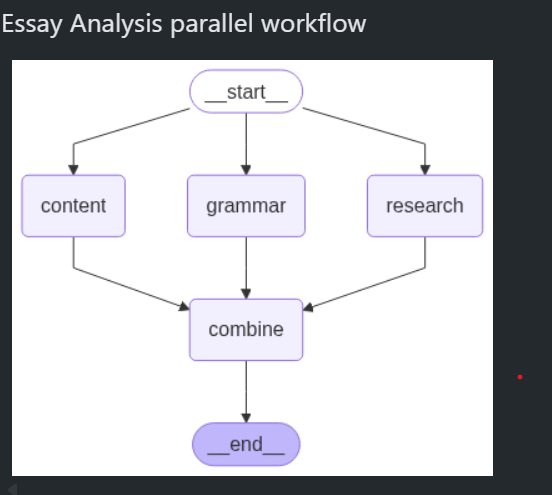
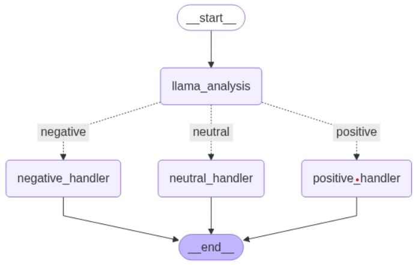

## Reflection Agent
Loop of Generation and Critique (Tools will be used in Reflexion Agent)

                   ┌────────────────────┐
                   │  Start: User Input │
                   └────────┬───────────┘
                            │
                            ▼
                   ┌────────────────────┐
                   │   initial (Chain)  │
                   │  Generate answer   │
                   └────────┬───────────┘
                            │
                            ▼
                   ┌────────────────────┐
                   │   reflect (Chain)  │
                   │ Analyze weaknesses │
                   └────────┬───────────┘
                            │
                            ▼
                   ┌────────────────────┐
                   │   improve (Chain)  │
                   │ Refine the answer  │
                   └────────┬───────────┘
                            │
                            ▼
          ┌────────────────────────────────────┐
          │      Check iteration limit         │
          │  if iteration < max → loop again   │
          └────────┬──────────────┬────────────┘
                   │              │
         ┌─────────▼───┐      ┌───▼─────────────┐
         │  reflect    │      │     END         │
         │ (next round)│      │  Final Output   │
         └─────────────┘      └─────────────────┘

## Parallel Workflows

## Conditional Workflows

## Iterative Workflows
Looping -> Helps improve